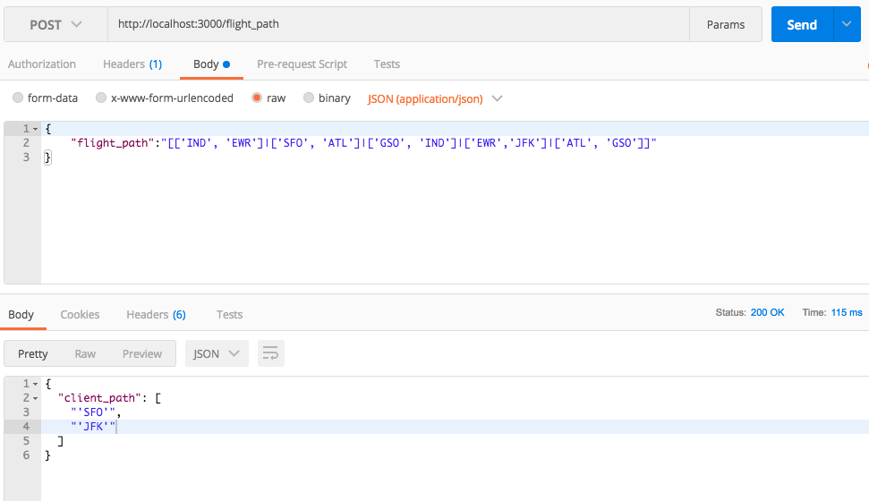

# Determine Flight Path

### Description
A Ruby on Rails API micro-service that allows to determine and track a particular person flight path.
It will show the initial source and final destination of his/her entire trip.
Example:
```
"[['SFO', 'EWR']]"                                                => ['SFO', 'EWR']

"[['ATL', 'EWR']|['SFO', 'ATL']]"                                 => ['SFO', 'EWR']

"[['IND', 'EWR']|['SFO', 'ATL']|['GSO', 'IND']|['ATL', 'GSO']]"   => ['SFO', 'EWR']
```


### Endpoint
The web API accepts a **POST** request to the URI **/flight_path** that includes a list of flights in the **body payload** (JSON format), which are defined by a source and destination airport code (just like the example from above). These flights may not be listed in order and will need to be sorted to find the total flight paths starting and ending airports.

**Endpoint:**
```
POST localhost:3000/flight_path
```
**Body** must be a **JSON** format with key -> **flight_path**:
```
{
	"flight_path":"[['IND', 'EWR']|['SFO', 'ATL']|['GSO', 'IND']|['EWR','JFK']|['ATL', 'GSO']]"
}
```

## Instructions to execute code
* Download the repository to your preferred directory from Github.
* Open a terminal, go to your proyect's directory and run `bundle install` --> Install all your dependencies gems.
* Must run this command `rails db:migrate` to create the tables and columns on Postgres Database.
* Later you must run:
* `rails s`  for the application to work on "localhost:3000".
* Use **Postman** to simulate a post request
   * 1) Each flight pathway pairs must be separate by `|` and with not `space` between each pair.
    * `[['IND', 'EWR']|['SFO', 'ATL']|['GSO', 'IND']|['ATL', 'GSO']]`
